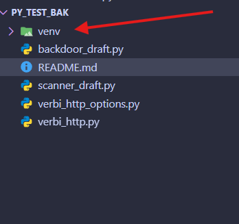

# Dobbiamo creare l'ambiente e attivalo


## Perché usare un Ambiente Virtuale (venv)?

Il `venv` (Virtual Environment) è una cartella isolata fondamentale per lo sviluppo in Python. Usarlo è una best practice che ti permette di:

* **Evitare conflitti tra progetti:** Ogni progetto usa versioni diverse delle librerie. Senza un venv, aggiornare una libreria per il *Progetto B* potrebbe rompere improvvisamente il *Progetto A*.
* **Mantenere pulito il PC:** Eviti di intasare l'installazione globale di Python del tuo sistema operativo con decine di pacchetti inutili.
* **Facilitare la condivisione:** Rende facilissimo esportare la lista esatta delle librerie usate, permettendo ad altri di far funzionare il tuo codice senza errori.


Per Windows:

```bash
py -m venv venv
```


Per macOS e Linux:

```bash
python3 -m venv venv
```


## 2. Attivare l'ambiente di sviluppo

Prima di installare qualsiasi libreria, devi "entrare" nell'ambiente. Saprai che è attivo quando vedrai la scritta `(venv)` comparire all'inizio della riga del tuo terminale.


Per Windows:

```dos
venv\Scripts\activate
```


Per macOS e Linux:

```dos
source venv/bin/activate
```


## 3. Gestire le dipendenze con il file `requirements.txt`


Il file `requirements.txt` è come la "lista della spesa" o la "ricetta" del tuo progetto. È un semplice file di testo che contiene l'elenco esatto di tutte le librerie esterne (e le loro specifiche versioni) necessarie per far funzionare il tuo codice (es. `requests==2.31.0`).

**Perché è fondamentale usarlo?**

* **Riproducibilità:** Assicura che chiunque scarichi il tuo progetto (o un server su cui decidi di caricarlo) utilizzi le tue stesse identiche versioni delle librerie. Questo evita i classici crash dovuti ad aggiornamenti imprevisti (la famosa sindrome del *"sul mio PC funzionava!"*).
* **Comodità e velocità:** Permette di installare decine di librerie in un colpo solo, senza dover scrivere il comando di installazione per ognuna di esse.

**I due comandi essenziali da ricordare:**

* **Per crearlo (salva la lista delle librerie che hai attualmente nel venv):**

```dos
pip freeze > requirements.txt
```

* Per installare le librerie (legge il file e scarica tutto in automatico nel nuovo venv):

```dos
pip install -r requirements.txt
```


## 4. Aggiornare pip (Consigliato)

È sempre buona prassi aggiornare `pip` (il gestore dei pacchetti di Python) subito dopo aver creato e attivato un nuovo ambiente:

```dos
python -m pip install --upgrade pip
```
(Per uscire dall'ambiente virtuale e tornare al terminale normale, ti basterà digitare `deactivate`).

**


