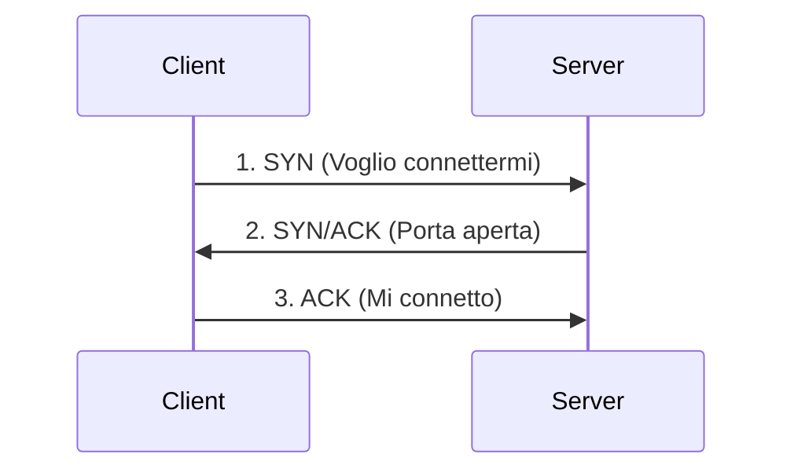
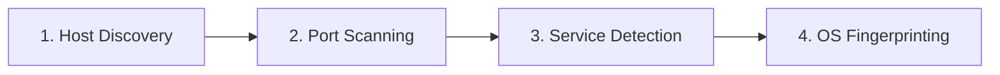
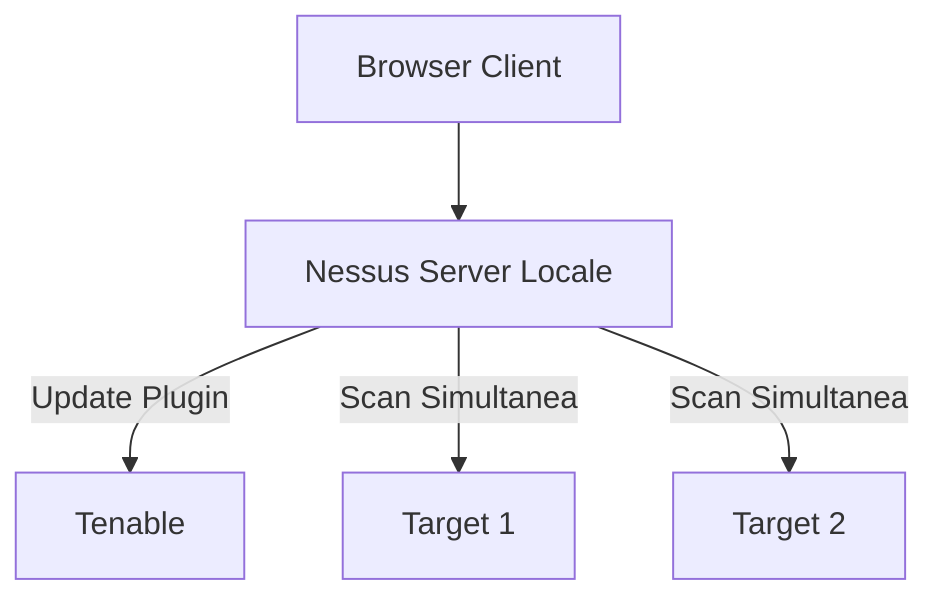

# 🛡️ Appunti Completi: Vulnerability Assessment con Nmap e Nessus

Questi appunti sostituiscono la lettura delle slide fornendo in modo **organizzato**, **chiaro** e **immediato** tutti i concetti e comandi fondamentali della lezione.

---

## 🚀 1. Prima di Iniziare: Setup (Slide 1-6)

Per affrontare il modulo, serve un ambiente di test correttamente configurato:
- 💻 **Requisiti di Sistema**: Macchina virtuale con **Kali Linux**, almeno **4 GB di RAM** e **2 Core di CPU**.
- 📥 **Nessus Essentials**:
  1. Registrazione gratuita su Tenable per ottenere l'**Activation Code**.
  2. Download del pacchetto (verificare l'architettura con `uname -m`, es. `x86_64`).
- ⚙️ **Comandi di Installazione su Kali**:
  ```bash
  # Installazione del pacchetto scaricato
  sudo dpkg -i Nessus-<versione>.deb

  # Avvio del demone in background
  sudo systemctl start nessusd.service

  # Verifica che il servizio sia attivo
  sudo systemctl status nessusd.service
  ```
- 🌐 **Accesso Web**: Aprire il browser all'indirizzo `https://localhost:8834` per creare l'account amministratore e scaricare il database dei plugin.

---

## 🕵️‍♂️ 2. Dalla Recon Passiva a quella Attiva (Slide 8-13)

Il passaggio alla **Scansione Attiva** (Day 2) è un cambio di marcia critico rispetto all'interazione a distanza di ieri.

| Aspetto | 🕶️ Recon Passiva | ⚔️ Recon Attiva |
| :--- | :--- | :--- |
| **Interazione** | Nessuna interazione diretta col target. | Invio diretto di pacchetti al target. |
| **Rilevabilità** | Invisibile al target (il target non sa niente). | Genera log e allarmi vistosi su firewall/IDS. |
| **Strumenti** | OSINT, Shodan, Whois, Google Dorking. | Nmap, Nessus, fping. |
| **Autorizzazione** | Non sempre necessaria (info pubbliche). | **SEMPRE NECESSARIA** (pena danni o azioni legali). |

> [!IMPORTANT]
> **Le Rules of Engagement (RoE)**
> Prima di qualsiasi scansione attiva, il cliente firma un accordo (RoE): esso definisce legalmente gli **IP bersaglio** (Scope), cosa **NON** toccare assolutamente (Out of Scope), i range orari autorizzati e procedure di emergenza.

---

## 🕸️ 3. Fondamenti di Rete: Ping e TCP (Slide 14-21)

La scoperta di host poggia su protocolli fondamentali di base TCP/IP.

### 🏓 ICMP (Ping)
Usato per controllare se un host è raggiungibile nella rete locale e su Internet:
- Invia: **Echo Request** (Type 8)
- Riceve: **Echo Reply** (Type 0) -> L'host è vivo.
- 💡 **Trucco del TTL (Time To Live)**: Il numero TTL in una risposta ping offre il primo indizio sul Sistema Operativo (OS):
  - **Linux/macOS**: parte da `64`.
  - **Windows**: parte da `128`.
  - **Router Cisco/Solaris**: parte da `255`.

*Esempio pratico IP Sweep (scansione rapida di una subnet silenziosa senza DNS)*:
```bash
fping -a -g 192.168.1.0/24 2>/dev/null
```

### 🤝 TCP 3-Way Handshake
La vera base con cui lavora Nmap per capire se una singola "porta" su un server è aperta o sbarrata.
*(N.B. Se il tuo editor non renderizza i grafici Mermaid, ecco lo schema visivo)*:
```text
[Client]                                           [Server]
   | -------- 1. SYN (Voglio connettermi) ----------> |
   | <------- 2. SYN/ACK (Porta aperta, pronto) ----- |
   | -------- 3. ACK (Perfetto, mi connetto) -------> |
```


- Se alla ricezione del SYN, il Server avesse risposto con un **RST**, la porta è **chiusa**.
- Se il server **non risponde** affatto, c'è un Firewall di mezzo (porta definita **filtrata**).

---

## 🗺️ 4. Nmap: Scanner Essenziale (Slide 22-55)

Nmap è il coltellino svizzero per l'esplorazione, opera rigidamente su **4 Fasi Sequenziali**:

> **Flusso Sequenziale**: [1. Host Discovery] ➔ [2. Port Scanning] ➔ [3. Service Detection] ➔ [4. OS Fingerprinting]



### 🔬 FASE 1: Host Discovery
- `nmap -sn <target>`: (Ping Scan) rileva solo chi è attivo sulla rete senza farsi rallentare dalla scansione porte. Super veloce su grandi reti.
- `nmap -Pn`: Bandiera fondamentale. Disabilita i ping fiduciosi e presume ciecamente che tutto sia attivo. **Essenziale** quando gli amministratori di un server chiudono le risposte al ping (bloccano gli ICMP) per sembrare invisibili.

### 🚪 FASE 2: Port Scanning (Stati: open, closed, filtered)
- **`-sS` (SYN Stealth Scan)**: Metodo diffusissimo ed elusivo perché non completa l'handshake TCP (tronca inviando un RST a metà). Evita i log applicativi di base. **Richiede utente root (`sudo`)** ed è il default dell'amministratore.
- **`-sT` (TCP Connect Scan)**: Completa onestamente tutto l'handshake. Rumoroso e visibile. È il default se non si hanno i permessi di amministrazione.
- **`-sU` (UDP Scan)**: Scova servizi deboli su UDP invisibili al TCP (DNS 53, DHCP 67, NTP 123), ma è lentissimo.
- **`-p`**: Seleziona le limitazioni porte (es. `-p 80,443`, oppure `-p 1-1024`, o estensivo per tutte le porte conosciute `-p-`).

### 📦 FASE 3: Service Detection (`-sV`)
Senza `sV` sai solo che la porta 80 è aperta; specificando `sV` Nmap interroga il servizio estraendone il banner, scoprendo l'esatto software (`es. Apache 2.2.8`). Serve ad applicare la falla CVE giusta.

### 💻 FASE 4: OS Fingerprinting (`-O`)
Cerca di dedurre il Sistema Operativo (Windows, Linux, IoT) inviando varianti strambe agli header TCP analizzandone le risposte peculiari e confrontandole con un proprio database interno ("firme software").

### ⚙️ Flag Magici ed NSE:
- **Scan Aggressivo (`-A`)**: Scorciatoia che lancia massivamente tutto assieme: `-O -sV -sC --traceroute`. Troppe tracce create però, va usato solo in laboratori non controllati.
- **Velocità (`-T0` fino a `-T5`)**: Regola la furia dei pacchetti per bypassare sensori.
  - `-T0` invia un pacchetto a malapena ogni 5 minuti (Paranoid/Paziente). Il default è `-T3`. `-T4` per reti stabili LAN. `-T5` lancia un numero esagerato e si creano disconnessioni/falsi negativi.
- **NSE (Nmap Scripting Engine)**: Automatizza dei pre-test usando librerie .lua.
  ```bash
  # Esempio potente: applicare filtri NSE su una singola rete per vedere attacchi note (vuln)
  sudo nmap --script vuln 192.168.1.0/24
  ```
- **Esportazione Output**: Se fai uno scan senza salvare la cronologia hai lavorato invano.
  - `-oA <nome>` = Esporta l'output in XML, formattazione grep e base tutto assieme in una directory.
  - `-oG <nome>`= Utile a formati log da command line. (Es. poi dai in pasto al terminale puro: `grep "open" output | cut -d " " -f 2` salvando la vita su liste lunghissime).

---

## 🎯 5. Nessus: Vulnerability Scanner (Slide 56-74)

Se Nmap ti offre le statistiche e l'inventario locale, **Nessus elabora un test automatizzato globale ed è mantenuto con un database in sync quotidiano di oltre 200.000 firme (Plugin)**!

- **Assessment != Penetration Test**:
  Nessus crea report visivi e categorizza dove puoi agire per migliorare l'azienda e che rischi corri. Il penetration test invece cerca brutalmente di intrufolarsi rubando token e admin powers per mostrare praticamente il disastro che verrebbe ad accaderi.

> **Struttura Client-Server**: Il *Browser Client* ordina la scansione al *Nessus Server Locale*. Quest'ultimo scarica gli update da *Tenable* ed esegue le scan simultanee su multipli *Target*.



### 🛠️ Eseguire il "Basic Network Scan" (Workflow)
1. **Dati Anagrafici / General**: Inserire bersaglio Target (IP o classe subnet), nome progetto.
2. **Discovery**: Qui si decide in che modo scoprire la LAN (Per default copre le 1000 porte principali, spesso gli analisti modificano per scansionare "All Ports" 1-65535, più lenta ma non perderà le backdoor nascoste in porte strambe come la `4444`).
3. **Pannello Risultati (La Verità in faccia)**:
   Le scan ritornano un prospetto con severità calcolate statisticamente (**Critical**🟥, **High**🟧, **Medium**🟨, **Low**🟩, **Info**🟦).
   - Aprirete una vulnerabilità a caso e noterete sempre: Nome, Score (CVSS), **Solution** imposta (come sistemarla velocemente) e **Plugin Output** (che prova ti fornisce lo scanner per certificare la presenza veritiera di quella vulenrabilità ignorando falsi-allarmi).

---

## 🚦 6. CVSS e EPSS: La Nobile Arte delle Priorità (Slide 75-89)

Cosa fai se Nessus ti restituisce un rapporto mensile di **3.500 difetti critici** sulla flotta Server? Semplicemente, metti in coda calcolando oggettivamente chi deve esser curato **questa sera**!

- **CVSS (Common Vulnerability Scoring System)**: Punteggio statico industriale tra 0.0 – 10.0 (gestito da FIRST).
  - È un miscelatore del "*Vettore di attacco*" base impiegato + "*Danno di gravità potenziale*".
  - **DIFETTO DEL METODO**: Nessuno asporta la CVSS se l'Exploit non viene abusato mai nella vita reale. Se ho un server offline bucato col CVSS al `9.8` farò correre tutti a patcharlo mentre gli hacker mi attaccano su macchine esterne usando piccole CVE minori.
  - La *versione 4.0* sta entrando in atto proprio per sfoltire l'ambiguità tra macchina originaria e reazioni a catena esterne.

- **CISA KEV (Known Exploited Vulnerabilities)**: Governo USA a disposizione della terra. Se **Tenable** segnala che la Falla Server che avevi è presente nella lista di ministeriale CISA KEV... significa che gli Hacker ti stanno prendendo a pugni su quella porta ADESSO con script gratuiti mondiali. DEVI AGGIORNARLA PRIMA CHE SIA TARDI.

- **EPSS (Exploit Prediction Scoring System)**: Uno strato intelligente Machine Learning che predice giorno su giorno con numeri tra `0 % – 100 %` un parere formale: "*Quale fra le nostre vecchie macchine ha il rischio di essere aggredita massicciamente entro i prossimi 30 Giorni di valenza?*"

> [!TIP]
> **Triage Corretto e Sintesi della Priorità**
> L'azienda ti pone l'onere delle scelte?
> 1. Falla presente in **CISA KEV**? -> SVEGLIA! Eseguire il fix questa sera stessa!
> 2. CVE Non KEV, ma CVSS Alta e **EPSS > 50%** (0.50 score)? -> Entro questa settimana pianificare la manutenzione attiva.
> 3. CVE ad alto CVSS **MA** probabilità EPSS di **0.01%**? -> Metti a calendario quando ci saranno risorse blande di riserva (Non perdere capitale umano sul panico falsato).

---

## 📈 7. Conclusioni: Analisi Gestione e Report (Slide 90-94)

L'output del System Admin non è solo risolvere ma spiegare ed operare a strati manageriali sui problemi (Security Audit):
- **La Formula Regina**: `Rischio = Probabilità x Impatto`.
- Opzioni strategiche per contenere una Vulneraibility una volta scoperta:
  1. **Risk Reduction**: Imporre alla ditta di patchare fisicamente l'intero ambiente al costo di stipendi ai programmatori. (Riduco a dismisura le tempistiche del danno imminente).
  2. **Risk Acceptance**: Evitare lo sforzo finanziario, accettando il problema (In caso di danno, la spesa dei server recuperati vale meno del costo orario della fix).
  3. **Risk Avoidance**: Scollegare definitivamente dal mondo Internet la struttura pericolante che ospitava la falla critica per evitare futuri attacchi.
  4. **Risk Transfer**: Trasferire la paura e la colpa ad altri, acquistando fondi Assicurativi contro danni ai terzi (*Cyber-insurance*).

**📝 La Roadmap Documentata**: Fornire grafici ed scadenze all'azienda. Le cose critiche vanno patchate nelle "Settimana 1-2". Altre priorità modeste nel "Mese 2-3". Una volta fatto... **fare ASSOLUTAMENTE una RE-SCAN** profonda di Nmap+Nessus, a causa degli aggiornamenti errati programmati frettolosamente che spesso spezzano intere nuove logiche applicative riportandoti a vecchi falle.
